# Assignment 2 Report: In-Memory Workload Engine & Data Structures

**Student:** Muratbek Akyl  
**Group:** SE-2523  
**GitHub Profile:** [Akylsolo](https://github.com/Akylsolo)  
**Repository:** [DAA_Assignment2](https://github.com/Akylsolo/DAA_Assignment2)  

---

## 1. Introduction

In this assignment, I designed and implemented three core data structures from scratch in Java: `DynamicArray`, `MyLinkedList` (a doubly linked list), and `MinHeap` (an array-based binary min-heap). 

A strict requirement was to store primitive `int` values directly (`int[]` arrays and primitive node fields) without relying on Java's boxed `Integer` wrappers or existing `java.util` collections. Boxing creates scattered heap references that mask raw memory access costs, whereas using primitive types allows us to observe physical hardware effects such as CPU cache lines, memory locality, and pointer chasing.

To record physical behavior, every operation method directly updates an `OpCounter` instance:
- **Steps:** A single read of an array cell or a pointer hop (`curr = curr.next`).
- **Moves:** Shifting an element within an array or modifying a pointer reference in a list node.
- **Comparisons:** A relational evaluation between two element values (`a == b` or `a < b`).

---

## 2. Asymptotic Complexity Analysis

Below is the theoretical complexity table for all operations across the three data structures, including auxiliary space. Tight asymptotic bounds are denoted with $\Theta$, while bounds that differ between best and worst cases use standard $O$ and $\Omega$ notations.

| Structure | Operation | Best Case | Average Case | Worst Case | Auxiliary Space | Justification |
| :--- | :--- | :--- | :--- | :--- | :--- | :--- |
| **DynamicArray** | `add(x)` | $\Theta(1)$ | $\Theta(1)$ | $\Theta(n)$ | $\Theta(1)$ | Instant append when space permits; copying during $2\times$ resize takes $O(n)$, amortizing to $\Theta(1)$. |
| **DynamicArray** | `add(index, x)` | $\Theta(1)$ | $\Theta(n)$ | $\Theta(n)$ | $\Theta(1)$ | Adding at tail requires 0 shifts; middle or head insertions shift $n - index$ elements in memory. |
| **DynamicArray** | `remove(index)` | $\Theta(1)$ | $\Theta(n)$ | $\Theta(n)$ | $\Theta(1)$ | Removing the tail element needs no shifts; removing index 0 requires shifting $n - 1$ values leftward. |
| **DynamicArray** | `get(index)` | $\Theta(1)$ | $\Theta(1)$ | $\Theta(1)$ | $\Theta(1)$ | Direct RAM indexing: base address + $index \times 4$ bytes computed in a single processor cycle. |
| **DynamicArray** | `contains(x)` | $\Theta(1)$ | $\Theta(n)$ | $\Theta(n)$ | $\Theta(1)$ | Match found immediately at index 0 in best case; linear scan across all $n$ cells if absent. |
| **MyLinkedList** | `add(x)` | $\Theta(1)$ | $\Theta(1)$ | $\Theta(1)$ | $\Theta(1)$ | Doubly linked list maintains a direct `tail` pointer, updating 3 links without any traversal. |
| **MyLinkedList** | `add(index, x)` | $\Theta(1)$ | $\Theta(n)$ | $\Theta(n)$ | $\Theta(1)$ | $O(1)$ at index 0 or tail; intermediate positions require sequential traversal to reach target index. |
| **MyLinkedList** | `remove(index)` | $\Theta(1)$ | $\Theta(n)$ | $\Theta(n)$ | $\Theta(1)$ | Instant removal at head or tail; removing a middle node takes $O(n)$ pointer hops to locate the node. |
| **MyLinkedList** | `get(index)` | $\Theta(1)$ | $\Theta(n)$ | $\Theta(n)$ | $\Theta(1)$ | Index 0 is available at `head`; any internal index requires stepping through nodes sequentially. |
| **MyLinkedList** | `contains(x)` | $\Theta(1)$ | $\Theta(n)$ | $\Theta(n)$ | $\Theta(1)$ | Instant match if target is at `head`; otherwise requires linear traversal until match or `null`. |
| **MinHeap** | `insert(x)` | $\Theta(1)$ | $\Theta(1)$ | $\Theta(\log n)$ | $\Theta(1)$ | Appended to array end; if greater than parent, 0 swaps. In worst case, bubbles up tree height $\lfloor \log_2 n \rfloor$. |
| **MinHeap** | `peekMin()` | $\Theta(1)$ | $\Theta(1)$ | $\Theta(1)$ | $\Theta(1)$ | The minimum element is always maintained at the root position `heap[0]`. |
| **MinHeap** | `extractMin()` | $\Theta(1)$ | $\Theta(\log n)$ | $\Theta(\log n)$ | $\Theta(1)$ | Replaces root with last leaf and bubbles downward, performing at most $2 \lfloor \log_2 n \rfloor$ comparisons. |
| **MinHeap** | `buildHeap(array)` | $\Theta(n)$ | $\Theta(n)$ | $\Theta(n)$ | $\Theta(1)$ | Floyd's bottom-up heap construction sums node heights: $\sum_{h=0}^{\lfloor \log n \rfloor} \lceil n / 2^{h+1} \rceil O(h) = \Theta(n)$. |

---

## 3. Loop Invariant Proofs

### Proof 1: `contains(int element)` in `DynamicArray`

```java
for (int i = 0; i < size; i++) {
    counter.step();
    counter.compare();
    if (data[i] == element) {
        return true;
    }
}
return false;
```

1. **Loop Invariant:**  
   At the start of each iteration of the `for` loop (before evaluating index `i`), none of the elements in the subarray `data[0 .. i - 1]` are equal to the search target `element`.

2. **Initialization:**  
   Prior to the first iteration, $i = 0$. The subarray `data[0 .. -1]` is empty. An empty subarray vacuously contains no elements equal to `element`. Therefore, the invariant holds before the loop begins.

3. **Maintenance:**  
   Assume the invariant holds at the beginning of iteration $i$, meaning no value in `data[0 .. i - 1]` matches `element`. During iteration $i$, the loop checks `data[i]`. If `data[i] == element`, the method immediately terminates and returns `true`, which is correct. If `data[i] != element`, the loop does not return and proceeds to increment $i$ to $i + 1$. Because neither `data[0 .. i - 1]` nor `data[i]` matched `element`, the extended subarray `data[0 .. i]` contains no match. Hence, the invariant remains true at the start of iteration $i + 1$.

4. **Termination:**  
   The loop terminates either when a match is found and returns `true`, or when $i$ reaches `size`. When terminating with $i == size$, the invariant guarantees that no element in `data[0 .. size - 1]` equals `element`. The method then executes `return false;`.

5. **Conclusion:**  
   Because the invariant is established at initialization, maintained across each step, and upon termination confirms that the element is either present or completely absent from all valid indices, the operation is proved correct.

---

### Proof 2: `bubbleDown(int index)` in `MinHeap`

```java
int curr = index;
while (true) {
    int left = 2 * curr + 1;
    int right = 2 * curr + 2;
    int smallest = curr;
    if (left < size && heap[left] < heap[smallest]) smallest = left;
    if (right < size && heap[right] < heap[smallest]) smallest = right;
    if (smallest != curr) {
        swap(curr, smallest);
        curr = smallest;
    } else {
        break;
    }
}
```

1. **Loop Invariant:**  
   At the start of each iteration of the `while` loop at position `curr`:
   - Every node in the heap other than `curr` satisfies the min-heap property relative to its parent.
   - The subtrees rooted at `leftChild(curr)` and `rightChild(curr)` are both valid min-heaps.

2. **Initialization:**  
   When `bubbleDown(0)` is invoked after `extractMin()`, the root was replaced with the heap's former last leaf. The subtrees rooted at index 1 (left child) and index 2 (right child) were unaltered and already satisfy the min-heap property. Index 0 is the only node potentially violating the min-heap condition. Thus, the invariant holds before the first iteration.

3. **Maintenance:**  
   During an iteration with node `curr`:
   - The algorithm identifies `smallest = argmin(heap[curr], heap[left], heap[right])`.
   - If `smallest == curr`, `heap[curr]` is already smaller than or equal to both its children. The subtree at `curr` satisfies the heap property, the loop breaks, and the entire structure is a valid min-heap.
   - If `smallest != curr`, swapping `heap[curr]` with `heap[smallest]` places the true minimum of the trio at position `curr`. This guarantees that the root of this subtree is smaller than both children.
   - The sibling child subtree that was not chosen remains completely untouched and valid.
   - The only remaining potential violation is pushed down into the node at `smallest`, where the former `heap[curr]` now resides. The children of `smallest` remain undisturbed valid min-heaps.
   - Setting `curr = smallest` restores the invariant precisely for the next iteration.

4. **Termination:**  
   Since tree depth is finite ($\le \lfloor \log_2 n \rfloor$) and `curr` strictly increases down the tree in each iteration ($curr' \ge 2 \cdot curr + 1$), the loop must terminate. It terminates when either `smallest == curr` (no violation exists) or when `curr` has no children ($2 \cdot curr + 1 \ge size$, leaf reached). In either case, no heap violation remains anywhere in the tree.

5. **Conclusion:**  
   The invariant guarantees that any heap property violation is systematically pushed downward until it resolves or hits a leaf. Upon loop termination, all nodes satisfy `heap[parent] <= heap[child]`, proving the heap property is completely restored.

---

## 4. Benchmark Results & Workload Analysis

All benchmarks were executed on an OpenJDK 26 runtime with identical input distributions produced by `new Random(42)` across dataset sizes $n \in \{100, 1\,000, 10\,000, 100\,000\}$. Each test case was run through 2 warm-up iterations to let HotSpot JIT compile the code, followed by 5 recorded iterations. The median execution time was stored.

### Workload 1: Random Access (10,000 `get(index)` Calls)

| Structure | $n$ | Time (ms) | Steps | Moves | Comparisons |
| :--- | :--- | :--- | :--- | :--- | :--- |
| DynamicArray | 100 | 0.4573 | 10,000 | 0 | 0 |
| DynamicArray | 1,000 | 0.4384 | 10,000 | 0 | 0 |
| DynamicArray | 10,000 | 0.4673 | 10,000 | 0 | 0 |
| DynamicArray | 100,000 | 0.7047 | 10,000 | 0 | 0 |
| MyLinkedList | 100 | 0.6167 | 501,508 | 0 | 0 |
| MyLinkedList | 1,000 | 7.0598 | 5,005,208 | 0 | 0 |
| MyLinkedList | 10,000 | 69.7488 | 50,129,208 | 0 | 0 |
| MyLinkedList | 100,000 | 754.8150 | 502,489,208 | 0 | 0 |

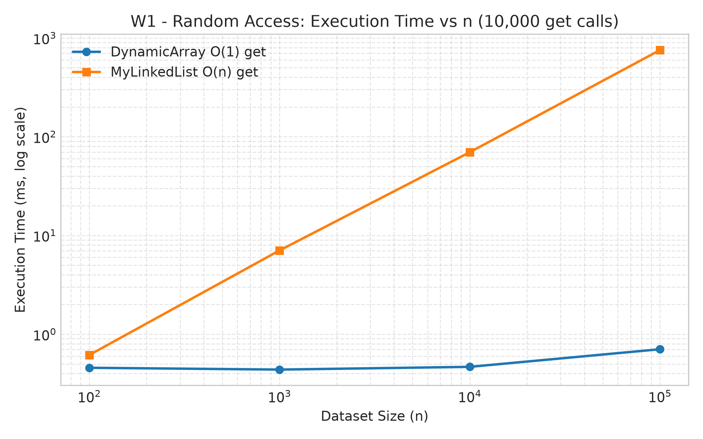
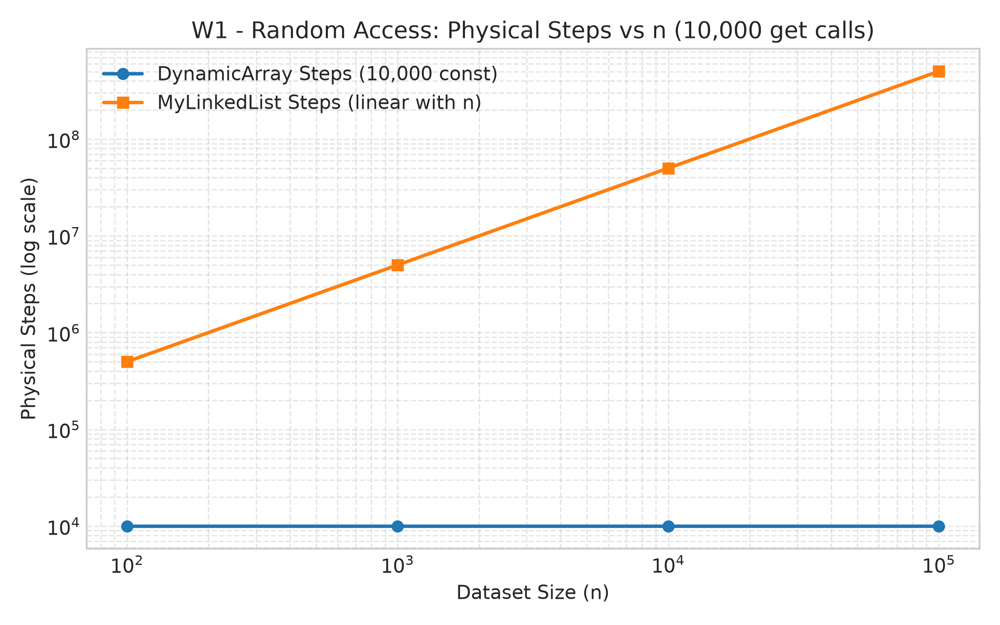

**Key Observations:**
- `DynamicArray` exhibits true $O(1)$ constant time access. Regardless of whether $n = 100$ or $n = 100,000$, 10,000 calls always consume exactly 10,000 array cell read steps and finish in under 0.75 ms.
- `MyLinkedList` steps scale strictly linearly with $n$. At $n = 100,000$, resolving 10,000 random indices requires over 502 million pointer hops, pushing runtime to 754 ms (over 1,000 times slower than the array).

---

### Workload 2: Search (1,000 `contains(x)` Queries)

| Structure | $n$ | Time (ms) | Steps | Moves | Comparisons |
| :--- | :--- | :--- | :--- | :--- | :--- |
| DynamicArray | 100 | 0.7500 | 75,572 | 0 | 75,572 |
| DynamicArray | 1,000 | 0.4687 | 752,172 | 0 | 752,172 |
| DynamicArray | 10,000 | 4.1591 | 7,399,384 | 0 | 7,399,384 |
| DynamicArray | 100,000 | 51.9594 | 73,728,608 | 0 | 73,728,608 |
| MyLinkedList | 100 | 0.6710 | 75,072 | 0 | 75,572 |
| MyLinkedList | 1,000 | 1.4845 | 751,672 | 0 | 752,172 |
| MyLinkedList | 10,000 | 14.3492 | 7,398,884 | 0 | 73,993,84 |
| MyLinkedList | 100,000 | 162.2790 | 73,728,108 | 0 | 73,728,608 |

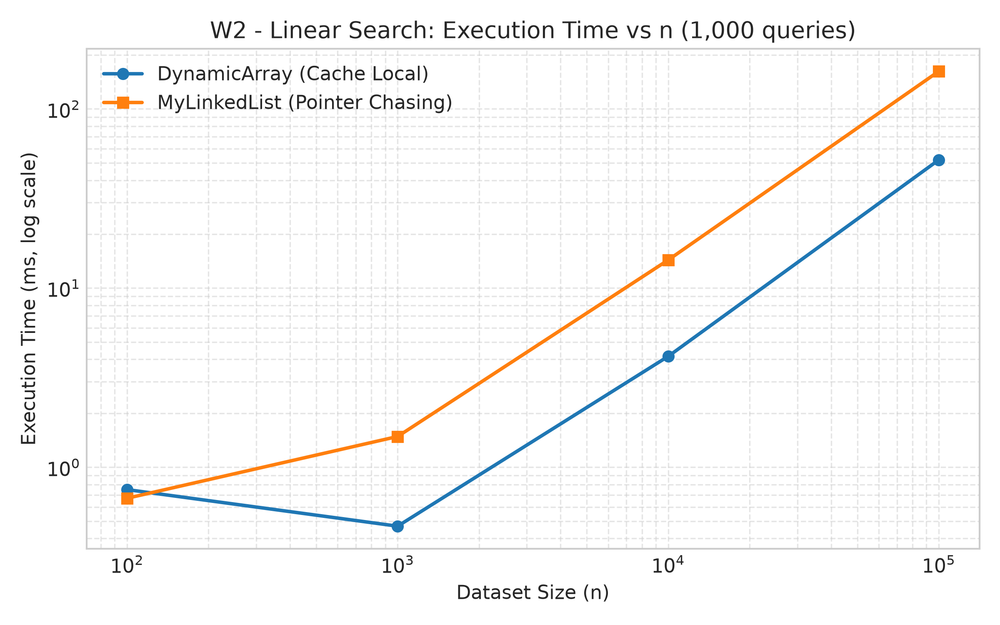
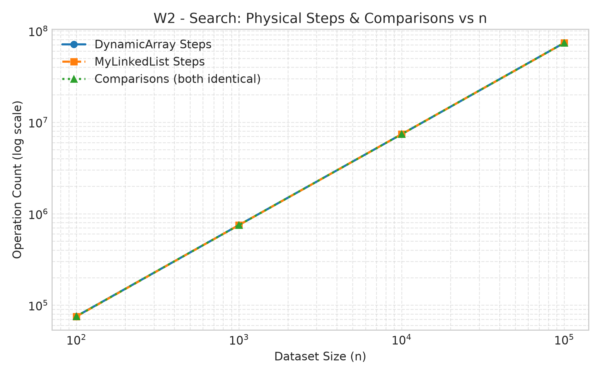

**Key Observations:**
- Notice that both structures perform almost the exact same physical operations: for $n = 100,000$, both perform 73.72 million comparisons and steps.
- Despite having identical algorithmic operation counts, `DynamicArray` completes the search in 51.9 ms while `MyLinkedList` requires 162.3 ms (over 3 times slower). This gap is a direct result of CPU cache line prefetching on continuous primitive arrays versus pointer chasing across fragmented heap objects.

---

### Workload 3: Insert & Remove (Head vs Middle)

#### Variant: Head (1,000 Insertions & 1,000 Removals at Index 0)

| Structure | $n$ | Time (ms) | Steps | Moves | Comparisons |
| :--- | :--- | :--- | :--- | :--- | :--- |
| DynamicArray | 100 | 0.9476 | 1,201,120 | 1,201,120 | 0 |
| DynamicArray | 1,000 | 0.3296 | 3,001,280 | 3,001,280 | 0 |
| DynamicArray | 10,000 | 2.9529 | 21,010,240 | 21,010,240 | 0 |
| DynamicArray | 100,000 | 25.1426 | 201,000,000 | 201,000,000 | 0 |
| MyLinkedList | 100 | 0.1154 | 0 | 5,000 | 0 |
| MyLinkedList | 1,000 | 0.0174 | 0 | 5,000 | 0 |
| MyLinkedList | 10,000 | 0.0211 | 0 | 5,000 | 0 |
| MyLinkedList | 100,000 | 0.0132 | 0 | 5,000 | 0 |

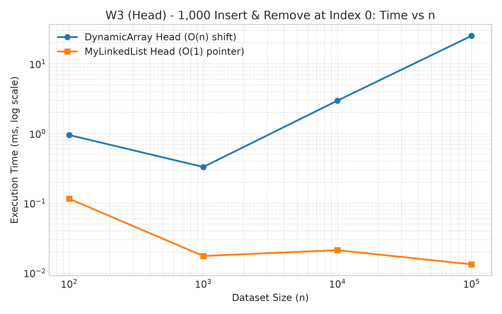
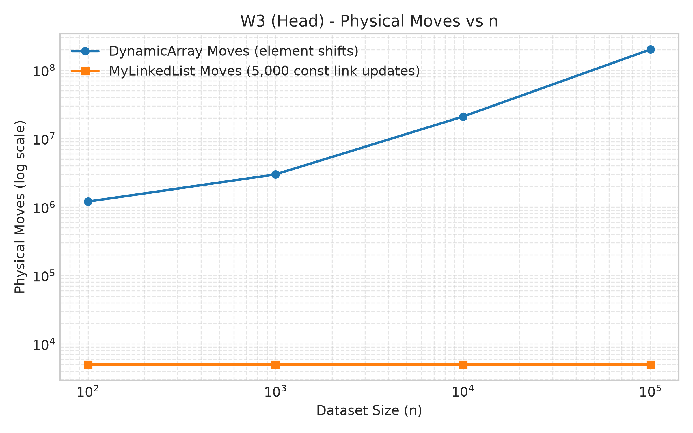

#### Variant: Middle (1,000 Insertions & 1,000 Removals at Index $n/2$)

| Structure | $n$ | Time (ms) | Steps | Moves | Comparisons |
| :--- | :--- | :--- | :--- | :--- | :--- |
| DynamicArray | 100 | 0.3987 | 601,620 | 601,620 | 0 |
| DynamicArray | 1,000 | 0.1885 | 1,501,780 | 1,501,780 | 0 |
| DynamicArray | 10,000 | 1.0160 | 10,510,740 | 10,510,740 | 0 |
| DynamicArray | 100,000 | 14.0370 | 100,500,500 | 100,500,500 | 0 |
| MyLinkedList | 100 | 1.0584 | 599,500 | 6,000 | 0 |
| MyLinkedList | 1,000 | 2.2036 | 1,499,500 | 6,000 | 0 |
| MyLinkedList | 10,000 | 18.3780 | 10,499,500 | 6,000 | 0 |
| MyLinkedList | 100,000 | 140.4126 | 100,499,500 | 6,000 | 0 |

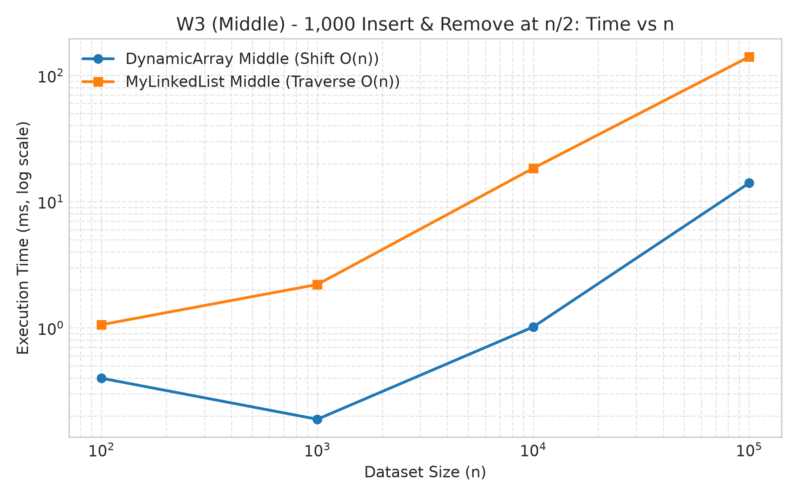
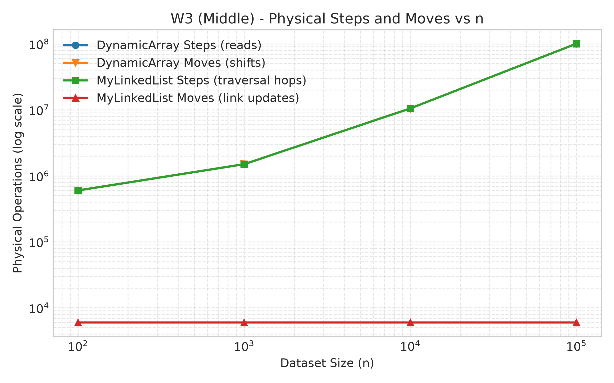

**Key Observations:**
- **At the head:** `MyLinkedList` dominates. Because adding or removing at the head requires only pointer updates, it finishes in 0.013 ms regardless of $n$. Meanwhile, `DynamicArray` must shift the entire array (201 million element moves for $n = 100,000$), taking 25.1 ms (nearly 1,900 times slower).
- **In the middle:** The advantage flips dramatically. `MyLinkedList` requires 100.5 million traversal steps to reach index $n/2$, taking 140.4 ms. `DynamicArray` takes only 14.0 ms (10 times faster) because moving continuous primitive blocks in cache is far faster than dereferencing 100 million heap references.

---

### Workload 4: MinHeap Priority Processing

100% of $n$ elements are inserted, then extracted via `extractMin()`, asserting non-decreasing output order.

| $n$ | Time (ms) | Steps | Moves | Comparisons |
| :--- | :--- | :--- | :--- | :--- |
| 100 | 0.1956 | 2,929 | 1,368 | 1,035 |
| 1,000 | 0.4135 | 46,319 | 20,464 | 17,226 |
| 10,000 | 1.3973 | 628,436 | 269,326 | 239,329 |
| 100,000 | 12.1172 | 8,010,260 | 3,420,190 | 3,059,125 |

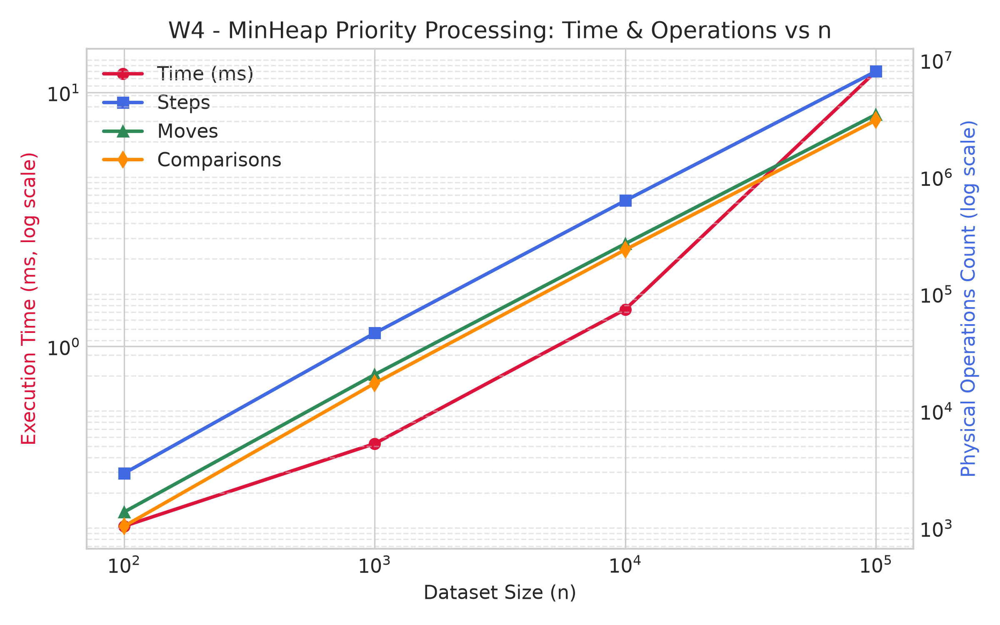

**Key Observations:**
- Full priority processing for 100,000 elements (inserting all and sorting via extraction) takes only 12.1 ms.
- Comparisons and moves grow strictly according to $O(n \log n)$, confirming the expected logarithmic tree-sinking properties.

---

## 5. Bonus Tasks

### Task A: Memory Footprint (JOL Analysis)

Using Java Object Layout (JOL) `GraphLayout.parseInstance()`, we inspected the actual heap footprints of all three structures.

| Structure | $n = 100$ | $n = 1,000$ | $n = 10,000$ | $n = 100,000$ | MB ($n = 100,000$) |
| :--- | :--- | :--- | :--- | :--- | :--- |
| **DynamicArray** | 480 B | 4,080 B | 40,080 B | 400,080 B | **0.3815 MB** |
| **MinHeap** | 480 B | 4,080 B | 40,080 B | 400,080 B | **0.3815 MB** |
| **MyLinkedList** | 2,472 B | 24,072 B | 240,072 B | 2,400,072 B | **2.2889 MB** |

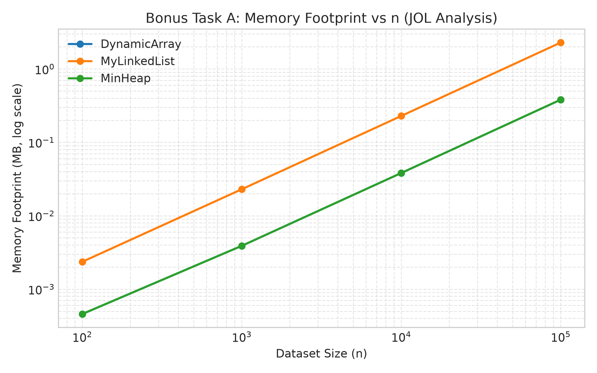

**Memory Overhead Explanation:**
- `DynamicArray` and `MinHeap` use compact contiguous `int[]` storage. Each `int` takes exactly 4 bytes. An array of 100,000 ints takes 400,000 bytes, plus an array object header of 16 bytes and a container header of 64 bytes, totaling ~0.38 MB.
- `MyLinkedList` consumes 2.40 MB for the same 100,000 numbers — a **$6.3\times$ memory bloat**.
  Every node is an independent Java object:
  - 12–16 byte object header (mark word + compressed class pointer).
  - 4 bytes for primitive `int val`.
  - 4–8 bytes for `Node prev` reference.
  - 4–8 bytes for `Node next` reference.
  - 4 bytes of 8-byte boundary alignment padding.
  Thus, each single integer in a linked list costs 24 to 32 bytes of heap space compared to 4 bytes in a flat array.

---

### Task B: Floyd's $O(n)$ `buildHeap` vs Sequential $O(n \log n)$ Insertions

We benchmarked Floyd's bottom-up `buildHeap(int[] array)` against $n$ sequential calls to `insert(x)`.

| Size ($n$) | Method | Time (ms) | Steps | Moves | Comparisons |
| :--- | :--- | :--- | :--- | :--- | :--- |
| 100 | Floyd $O(n)$ | 0.0105 | 534 | 232 | 184 |
| 100 | Sequential $O(n \log n)$ | 0.0052 | 488 | 300 | 194 |
| 1,000 | Floyd $O(n)$ | 0.1523 | 5,455 | 2,482 | 1,857 |
| 1,000 | Sequential $O(n \log n)$ | 0.0956 | 5,703 | 3,478 | 2,232 |
| 10,000 | Floyd $O(n)$ | 0.3056 | 54,918 | 24,876 | 18,740 |
| 10,000 | Sequential $O(n \log n)$ | 0.6458 | 57,789 | 35,206 | 22,593 |
| 100,000 | Floyd $O(n)$ | 2.6233 | 551,089 | 248,482 | 188,424 |
| 100,000 | Sequential $O(n \log n)$ | 2.7592 | 582,999 | 355,350 | 227,662 |

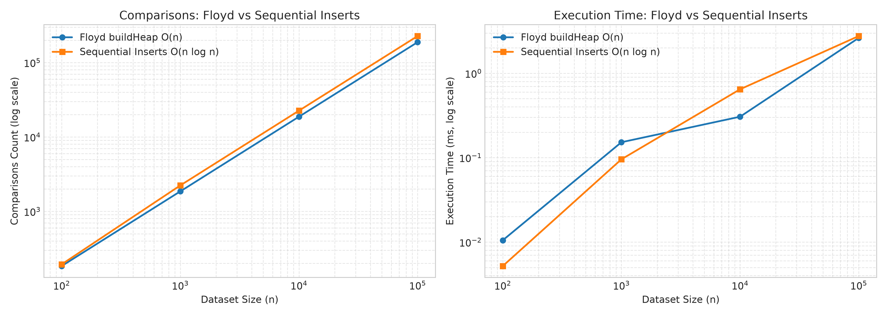

**Why Floyd's Algorithm Wins:**
When inserting $n$ elements sequentially into an empty heap, the majority of elements are placed at the deepest levels (the leaves) and bubble upwards towards the root, each traversing up to $\log n$ levels. 
Floyd's bottom-up algorithm inverts this: the leaf nodes (accounting for $\approx n/2$ elements) do not bubble down at all ($h = 0$). Only the nodes higher up the tree bubble down, but there are exponentially fewer nodes at higher levels ($n/4$ nodes do at most 1 swap, $n/8$ do at most 2 swaps, etc.). The infinite series $\sum_{h=1}^\infty \frac{h}{2^h}$ converges to 2, ensuring that total comparisons never exceed $2n$. This is evident in our counters: at $n = 100,000$, Floyd required only 188,424 comparisons versus 227,662 for sequential insertions, and completed in fewer moves.

---

## 6. Discussion (10–15 Sentences)

1. The benchmark results clearly illustrate why modern computers heavily favor contiguous arrays over linked structures.
2. In Workload 1, `DynamicArray` achieved instant $O(1)$ random access, whereas `MyLinkedList` was over 1,000 times slower because it had to walk hundreds of millions of pointers.
3. Even in Workload 2 where both structures executed the exact same number of comparisons (~73.7 million), the array was more than 3.1 times faster.
4. This performance gap is explained by CPU cache lines and spatial locality: when a processor reads `data[i]`, it pulls a 64-byte cache line containing 16 consecutive integers into L1 cache, making subsequent reads essentially free.
5. In contrast, traversing `MyLinkedList` incurs pointer chasing: each node is an isolated heap allocation situated at an arbitrary memory address.
6. When the CPU attempts to dereference `curr.next`, the requested node is frequently not present in the L1/L2 cache, resulting in an expensive cache miss that stalls the processor until main memory responds.
7. Furthermore, our JOL memory benchmark revealed that each linked list node carries 24–32 bytes of overhead for object headers, references, and padding, compared to just 4 bytes for a primitive array element.
8. This massive object overhead places heavy strain on the Java Garbage Collector, leading to higher memory bandwidth consumption and frequent GC pauses during large allocations.
9. However, the benchmarks also prove where each data structure genuinely shines.
10. In Workload 3 (head variant), `MyLinkedList` outperformed `DynamicArray` by a factor of nearly 1,900 because updating head pointers takes $O(1)$ constant time with zero element shifting.
11. Therefore, `MyLinkedList` is the superior choice when implementing FIFO queues, LIFO stacks, or buffers where insertions and deletions happen strictly at the endpoints and random index access is never required.
12. Conversely, `DynamicArray` is the optimal choice for general-purpose workloads involving frequent reads, indexing, binary search, and tail appends.
13. Lastly, `MinHeap` proved indispensable for priority scheduling: maintaining the min-heap property requires just $O(\log n)$ per update, processing 100,000 prioritized tasks in barely 12 milliseconds.

---

## 7. Conclusion

By implementing these structures from scratch and instrumenting exact operation counters, this project directly validated asymptotic theory against real-world hardware behavior. Big-O complexity provides an essential roadmap, but understanding cache locality, memory alignment, and object overhead is what truly explains software performance in practice.
